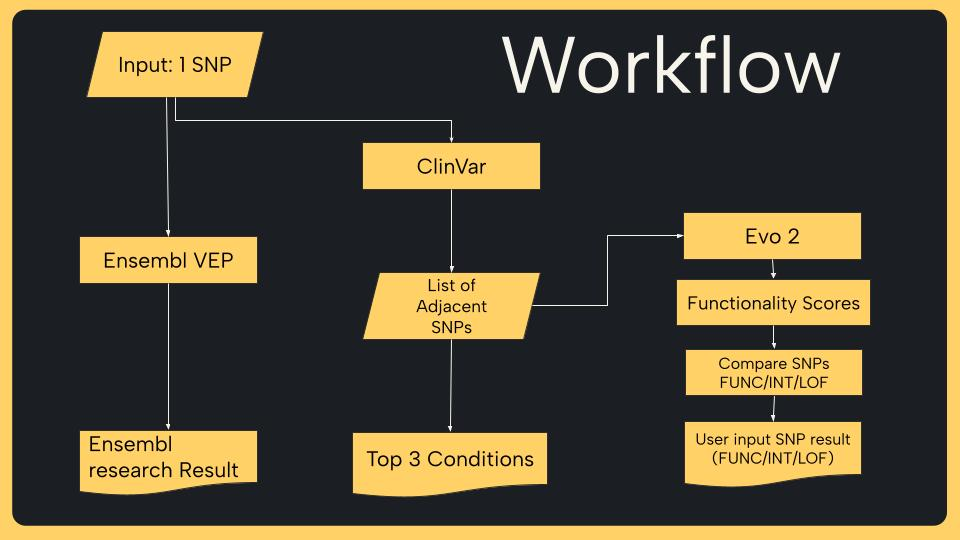
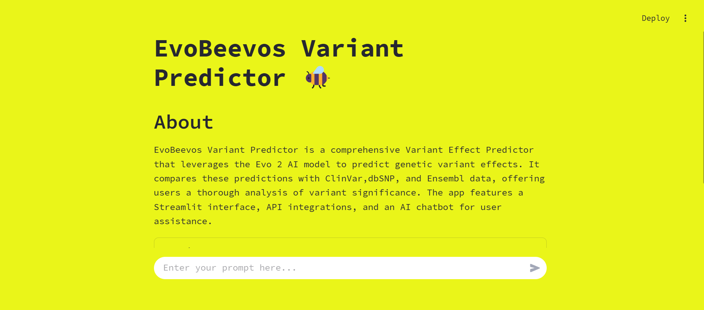

> QBI Hackathon (UCSF, UCB, and UCSC), Mar 08-09, 2025

# EvoBeevos Variant Predictor

## Overview

EvoBeevos Variant Predictor is a comprehensive Variant Effect Predictor that leverages the Evo 2 AI model to predict genetic variant effects. It compares these predictions with ClinVar data and Ensemble data, offering users a thorough analysis of variant significance. The app features a Streamlit interface, API integrations, and an AI chatbot for user assistance.

[Presentation Slides](https://docs.google.com/presentation/d/1zzawLlJqbMGvHXB5qwNDyX6UhS8TQLWEYcScaHH_GfU/edit?usp=sharing)

## Workflow


## Usage

```bash
streamlit run Evobeevos_interface.py
```



### Note on Evo 2 Integration
While EvoBeevos Variant Predictor was designed to utilize the Evo 2 AI model for variant effect prediction, we encountered dependency issues that prevented its installation. Despite this, we successfully implemented other core functionalities, including ClinVar and Ensembl data comparisons, API integrations, and an AI-powered chatbot for user assistance. Future updates may revisit Evo 2 integration as dependency resolutions become available.

## Contributors
* Tien Ly
* Heather Ho
* Solhee Tucker
* Patricia Saito
* Lawrence Fung
* Preethi Nalluru
